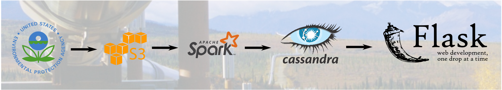

# Air Pollution

This is my project for Insight Data Engineering program. The goal of this project is to develop a tool for real-time analysis of the air pollution data in the analytical stations across the U.S., and compute the levels of pollution in unmonitored locations.

## Table of contents
1. [Summary](README.md#summary)
2. [Practical significance](README.md#practical-significance)
3. [Data](README.md#data)
4. [Methods](README.md#methods)
5. [Challenges](README.md#challenges)
    * [Data cleanup](README.md#data-cleanup)
    * [Combining different data sources](README.md#combining-different-data-sources)
    * [Computation](README.md#computation)
4. [Proposed pipeline](README.md#requirements-and-dependencies)

## Summary

Environmental Protection Agency (EPA) routinely measures concentrations of various pollutants in the atmosphere, including, for example, carbon monoxide (CO), sulfur oxides (SO*x*), and of solid particles in the air. These data are accumulated at air control stations that aren't usually located in residential areas. This project will use the EPA datasets to estimate the content of pollutants in the atmosphere at arbitrary locations in real time.

## Practical significance

The result of the project will be a Web application showing real-time heat map of the U.S. mainland. It could be useful for visualizing local air quality/warning when air quality is unacceptable. The data processed by the pipeline could also be used by data scientists to develop predictive models of air quality.

## Data

The complete measurement data is available free of charge on [EPA website](https://aqs.epa.gov/aqsweb/airdata/download_files.html#Raw) for the years 1980-2017, measured every hour at all locations across US. The amount of data is ~10 Gb/year for years after 2000.

## Methods

Spacial inter(extra)polation is a common problem. Here are some of the [methods](http://www.integrated-assessment.eu/eu/guidebook/spatial_interpolation_and_extrapolation_methods.html) for addressing it:
* Nearest neighbor method (Voronoi polygons)
* Inverse distance weighting
* Splines
* Geostatistical methods (*kriging*)

In addition, there are more complicated methods (e.g., http://journals.plos.org/plosone/article?id=10.1371/journal.pone.0096111) that use information about the temperature and wind data to improve the accuracy of predictions.

## Challenges

### Data cleanup

The data provided by the EPA is not clean - a brief inspection of the dataset reveals measurements reported in the future years and formatting issues. Some stations/detectors could be broken/on maintenance in certain time windows, and would not send the data. Also, different units of measurement could be used depending on the measurement methods used at each station.

### Combining different data sources

The data sets for various pollutants and weather conditions could be coming from different stations - checks are required to make sure the data are consistent.

### Computation

Computation of interpolated geospatial data is an expensive procedure, as [previous Insight project](https://github.com/CCInCharge/campsite-hot-or-not) has shown. My project will require performing extrapolations for even larger number of locations, and for several types of pollutants at the same time. Combining pollution data with weather conditions data will add another interesting dimension to the problem and increase its complexity.

## Proposed pipeline

1. Ingest environmental dataset
2. Clean up the data
3. Precompute the grid for the heatmap
4. Using streaming data (~8k events/s), compute distribution of various pollutants on the grid; also compute averages over longer periods of time

